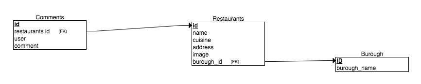
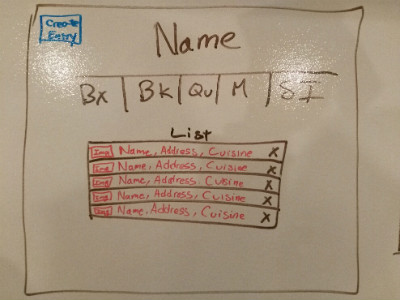
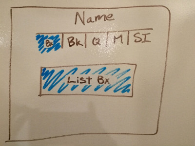
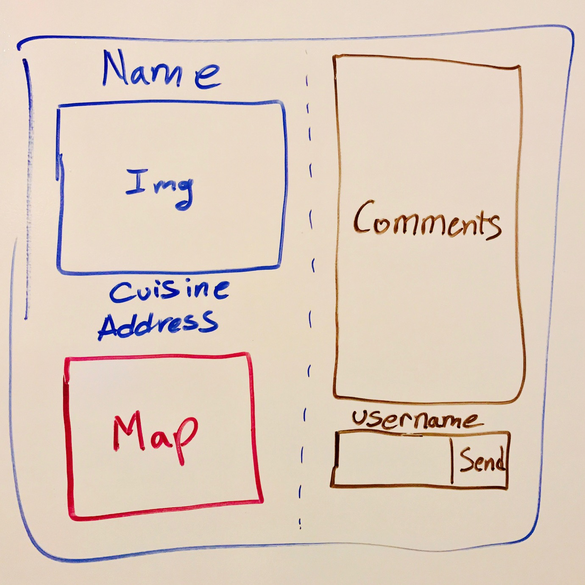
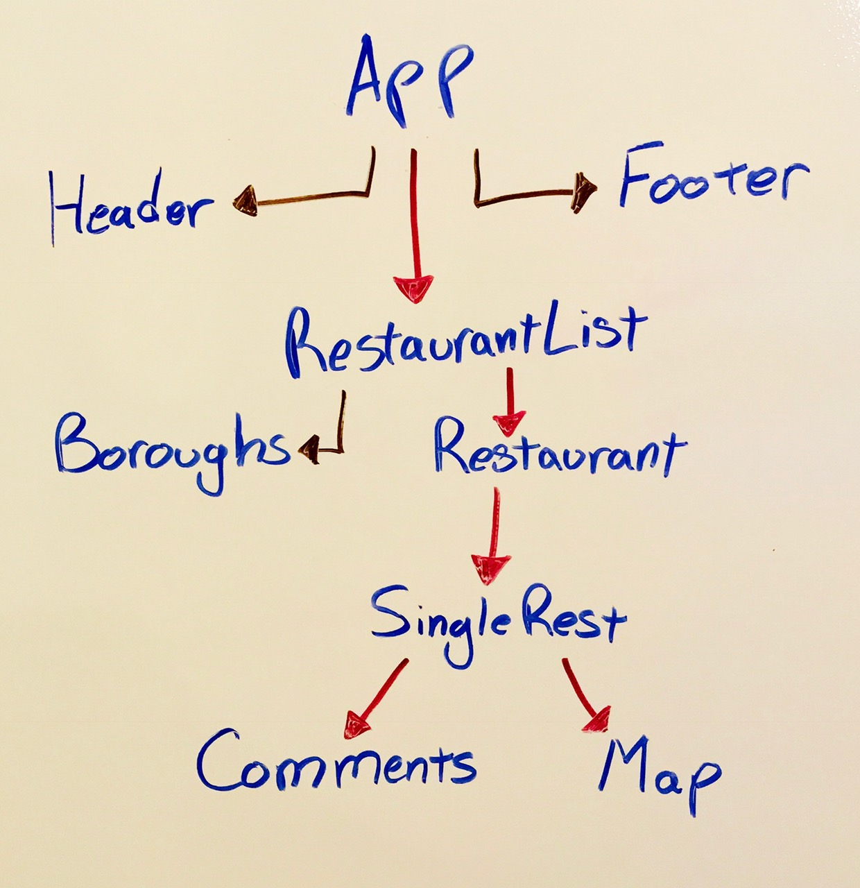
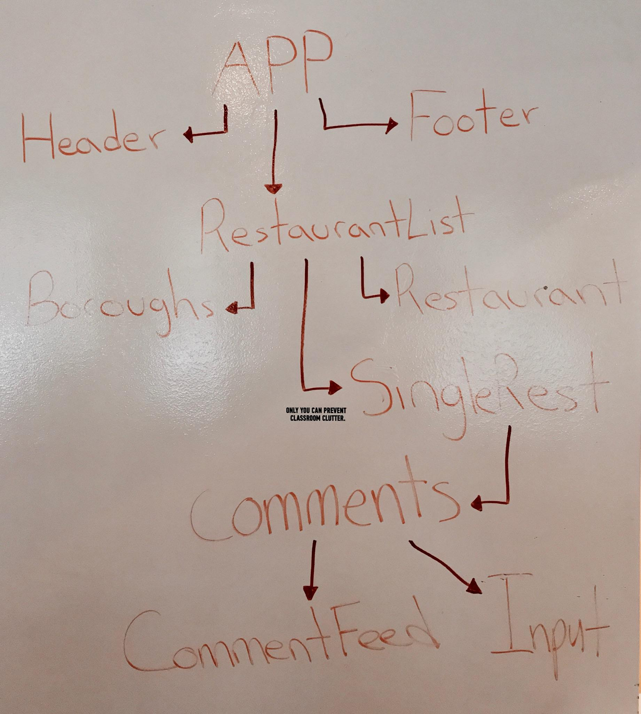

# Project 3 - Hidden Eateries NYC
*by James Wong, Alex Gorokholinsky and Eric Vargas*

## Concept
Hidden Eateries NYC is an app that uses our own API of the most noteable restaurants/cafes in each borough of New York City. It renders the entries in a user-friendy view with abilities to filter the entries by borough and cuisine, add new ones, write comments for each entry, and delete both comments and entries.

## ERD

## User Stories
As a user, I would like to see all the cool restaurants and cafes in different boroughs of NYC. I want to be able to filter them by borough and cuisine type. I want to be able to add/edit comments on each restaurant/cafe. I also want to be able to add new entry to the database if I discover a new Cafe/Restaurant that I believe deserves to be added to the API. 
It would be nice (if the creators of the app can reach post-MVP), to be able to sign in into my own account and leave individual comments based on my user profile.

## Wireframes
**Front Page** 
  
**Filtered by Borough** 
  
**Individual View for each Restaurant Entry** 
  

## Pseudocode

#### HTML
* Scaffolding for desktop/mobile

#### React
* Create the react app
* Install modules (axios,react-router,etc)
* Upload to master branch
* Work on components (list,nav,header/title,footer, etc)
* Work on routes (location and each restaurant, etc)
* Test components/routes
* Style

#### Express
* Create express generator
* Install modules(cors, pg promise, bluebird,etc)
* Upload to master branch
* Create local database and populate
* Work on routes(CRUD, individual routes for each location, and restaurant)
* Move database to heroku
* Test routes on postman

## Technologies Used

### Express
* Bluebird
* Nodemon
* Morgan
* Pg-promise
* CORS
* Express-generator

### React
* React-router
* Axios
* React-social-icons
* Create-react-app

### Post-Production

### Post MVP
Authentication for individual user login, 
Ratings with S.T.A.R.S. 

**Third Party Technology** 
Google Maps API _for displaying location on a map_

## Follow our progress
### [Heroku API](https://hiddeneateries.herokuapp.com/) 

* /boroughs _Lists all Boroughs_
* /comments _Lists all Comments_

### [Github Project Board](https://git.generalassemb.ly/goalexey/project_03/projects/1)

### [Live Site](https://hiddeneateries-rpkidiwjbc.now.sh/)

## Unsolved Problems
* Cannot figure how to load the asynchronous script of Google Maps into React, it requires multiple components to produce one small div.
* Trying to wrap our head around how Autho works while not interfering with the current progress.

# Download Project & Install
-------------

1. [Git clone or download our project]('https://git.generalassemb.ly/goalexey/project_03/')
2. On your terminal, run psql -f ./models/food.sql
3. Then run npm install
4. Last run npm start, the app should load up on localhost:3000
